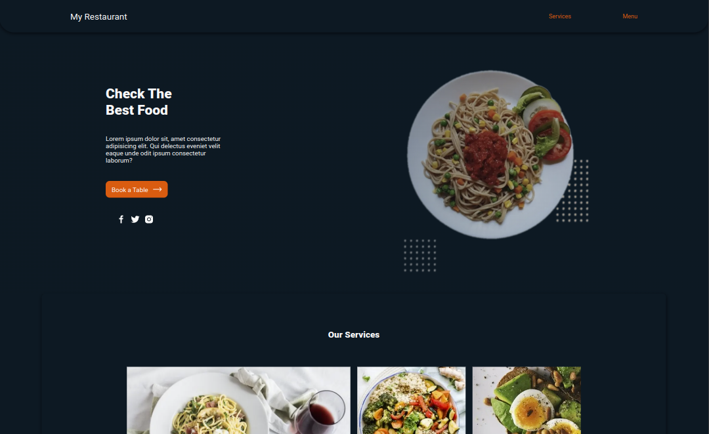
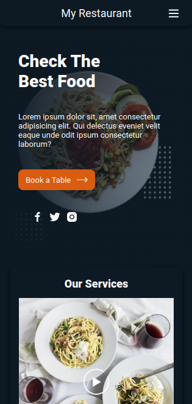

<h1 align="center" id="title">Restaurant Landing Page</h1>

		
    
		

  
  

THis project is an Static Website, build with CSS and HTML using css grid to create an appropiate and responsive layout. You can see the project deployed [here](https://monoald.github.io/restaurant-landing-page/).

## License

> This project is licensed under the MIT License
## Extra

### What I learn
I learn how to create big layouts with css grid to flow the desing with different screen sizes.